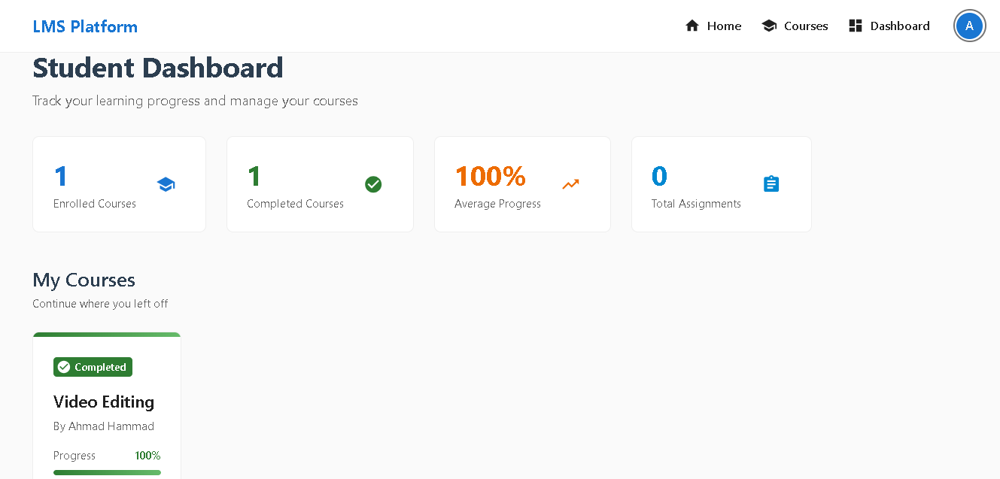
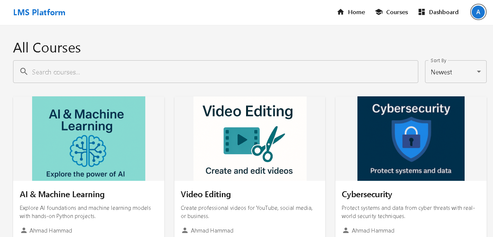
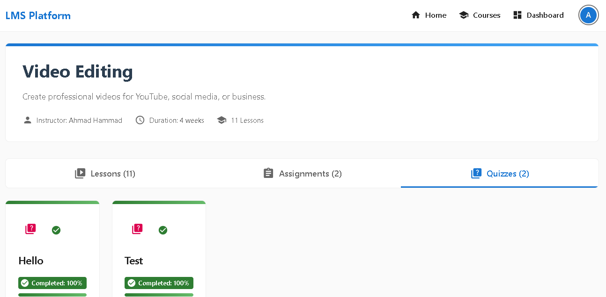
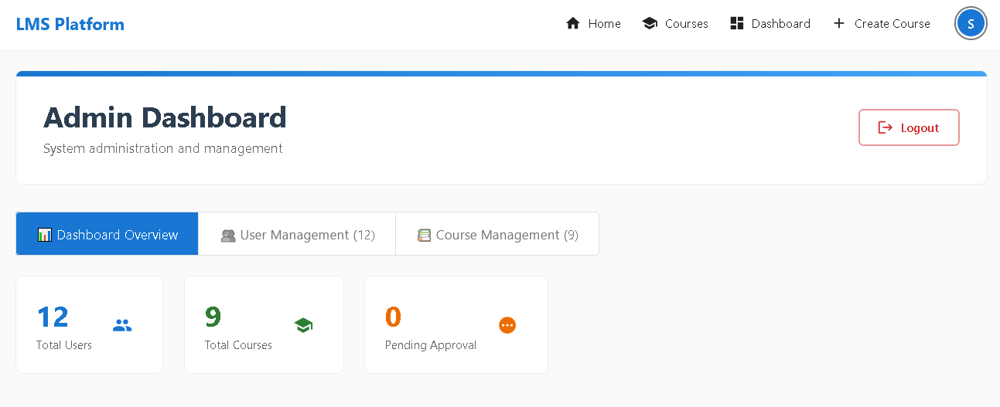

# 🎓 LMS Frontend

A fully responsive, role-based frontend interface for a complete Learning Management System (LMS) built using **React.js** and **Material UI**.  
This frontend connects seamlessly with the [LMS Backend API](https://github.com/ahmadh9/lms-backend-api) and supports multiple user roles: `student`, `instructor`, and `admin`.

---

## 🚀 Overview

The LMS frontend delivers all features expected from a professional e-learning platform:

- Dynamic role-based dashboards
- Course browsing and enrollment
- Lesson navigation and completion tracking
- Interactive quizzes and assignment submissions
- Instructor course creation and grading tools
- Admin control panels

Built using modern React patterns (hooks, context, modular services), the app is designed for maintainability, performance, and scalability.

---

## 👥 Supported Roles

### 🧑‍🎓 Student
- Enroll in courses
- View lessons
- Submit assignments and quizzes
- Track progress in real-time

### 🧑‍🏫 Instructor
- Create and manage courses
- Upload lessons (video link, text, or file)
- Review and grade student submissions

### 🛠️ Admin
- Approve or reject courses
- Manage users and categories
- View platform-wide analytics

---

## 🧩 Tech Stack

| Layer      | Technology               |
| ---------- | ------------------------ |
| Frontend   | React.js (Vite / CRA)    |
| UI Library | Material UI (MUI v5)     |
| Routing    | React Router DOM         |
| State Mgmt | React Context + useState |
| HTTP       | Axios                    |
| Auth Flow  | JWT + Google OAuth       |

---

## 🗂️ Project Structure

lms-frontend/
├── public/
├── src/
│ ├── pages/
│ ├── components/
│ ├── services/
│ ├── context/
│ └── App.js, index.js
├── screenshots/ # ✅ contains images used below
│ ├── student-dashboard.png
│ ├── courses-page.png
│ ├── quiz-tab.png
│ └── admin-dashboard.png
├── .gitignore
├── package.json
└── README.md


---

## 📸 Sample Screenshots

### 🧑‍🎓 Student Dashboard


### 📚 Courses Page


### ❓ Quiz Tab (Student)


### ⚙️ Admin Dashboard


---

## 🔑 Key Features

### 🧭 Navigation & Layout
- Clean responsive layout
- Protected routes per role
- Auto-updated navigation bar

### 📚 Courses & Lessons
- Browse courses by category
- Enroll and track progress
- Modular structure (Modules → Lessons)
- Video support (YouTube, .mp4, or links)

### 📝 Assignments & Quizzes
- Interactive quiz pages
- Auto-graded quizzes
- File upload for assignments
- Instructor feedback

### 🛡️ Authentication
- Google OAuth & Email/Password login
- JWT-based protection
- Role-based UI rendering

---

## 🛠️ Setup Instructions

```bash
# 1. Clone project
git clone https://github.com/ahmadh9/lms-frontend.git
cd lms-frontend

# 2. Install dependencies
npm install

# 3. Create .env file

VITE_API_URL=http://localhost:5000/api

# 4. Run development server
npm run dev

🌐 API Dependency

This project depends on the backend API:

👉 LMS Backend API GitHub Repo
✨ Deployment Tips

    Ensure CORS is enabled for frontend domain

    Set VITE_API_URL correctly for production

    Recommended deployment: Vercel or Netlify

👨‍💻 Developed by Ahmad Hammad

📧 ahmadkhammad95@gmail.com
🐙 GitHub: @ahmadh9
